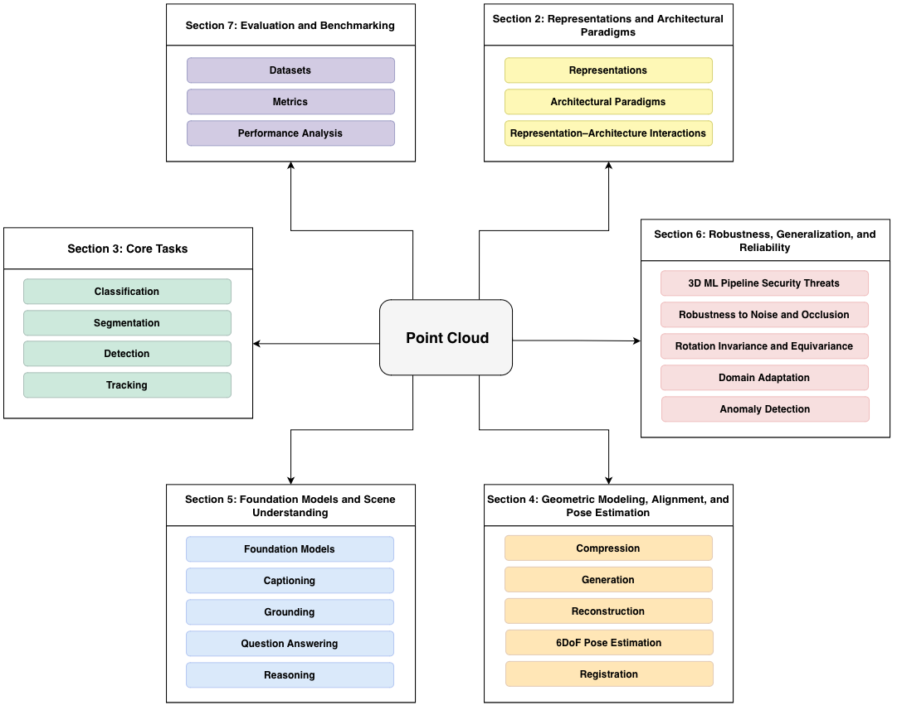

## 🚀 [TMLR'26] A Comprehensive Survey on 3D Deep Learning Point Cloud

This repository belongs to the paper: [A Comprehensive Survey on 3D Deep Learning Point Cloud](https://openreview.net/forum?id=WpQdfOC36s).

## 📝 Abstract
Recently, point cloud data has attracted the attention of researchers
as a promising data representation model for a wide range of
applications. As unlike 2D data, point clouds are unordered, irregular,
and often large in scale, they might impose severe challenges when
designing deep learning models. Over the past decade, substantial
progress has been made in proposing architectures that address
permutation invariance, geometric reasoning, scalability, and
robustness, leading to rapid expansion across diverse 3D data oriented
applications. The main aims of this paper are to present a comprehensive
survey on existing literature and to analyze how different 3D
representations have shaped the design and performance of deep learning
models. In contrast to prior surveys that have emphasized on limited
task subsets or specific model families, this survey reviews deep point
cloud models through representation- and architecture-centric
perspective. As such, beyond (1) core tasks such as classification,
segmentation, detection, and tracking, this survey systematically
provides insight into recent progress in broader directions, including
(2) geometric modeling, alignment, and pose estimation, (3) foundation
models and scene understanding, and (4) robustness, generalization, and
reliability. Furthermore, this survey presents commonly used datasets
and evaluation metrics, and finally summarizes challenges and future
directions toward robustness, efficiency, and generalizability of 3D
point cloud systems.


<p align="center">
  
</p>


## 📚 Existing Surveys on 3D Point Cloud
- **Deep learning for 3d point clouds: A survey**, TPAMI 2020, [ :link: ](https://arxiv.org/abs/1912.12033)

- **Deep learning for 3d point cloud understanding: a survey**, Arxiv 2020, [ :link: ](https://arxiv.org/abs/2009.08920)

- **Transformers in 3d point clouds: A survey**, Arxiv 2022, [ :link: ](https://arxiv.org/abs/2205.07417)


- **A survey on deep learning based segmentation, detection and classification for 3d point clouds**, MDPI 2023, [ :link: ](https://www.mdpi.com/1099-4300/25/4/635)


- **A comprehensive overview of deep learning techniques for 3D point cloud classification and semantic segmentation**, Springer 2024, [ :link: ](https://link.springer.com/article/10.1007/s00138-024-01543-1)


- **Diffusion models in 3d vision: A survey**, Arxiv 2024, [ :link: ](https://arxiv.org/abs/2410.04738)


## 📑 Contents


### Representations and Architectural Paradigms
- Representations
- Architectural Paradigms
- Representation-Architecture Interactions

> These topics are discussed in the paper and do not have dedicated folders in this repository.

### [Core Tasks](Core%20Tasks/)
- [Classification](Core%20Tasks/README.md#Classification)
- [Segmentation](Core%20Tasks/README.md#Segmentation)
- [Detection](Core%20Tasks/README.md#Detection)
- [Tracking](Core%20Tasks/README.md#Tracking)


### [Geometric Modeling, Alignment, and Pose Estimation](Geometric%20Modeling%2C%20Alignment%2C%20and%20Pose%20Estimation/)
- [Compression](Geometric%20Modeling%2C%20Alignment%2C%20and%20Pose%20Estimation/README.md#Compression)
- [Generation](Geometric%20Modeling%2C%20Alignment%2C%20and%20Pose%20Estimation/README.md#Generation)
- [Reconstruction](Geometric%20Modeling%2C%20Alignment%2C%20and%20Pose%20Estimation/README.md#Reconstruction)
- [6DoF Pose Estimation](Geometric%20Modeling%2C%20Alignment%2C%20and%20Pose%20Estimation/README.md#6DoF-Pose-Estimation)
- [3D Point Cloud Registration](Geometric%20Modeling%2C%20Alignment%2C%20and%20Pose%20Estimation/README.md#3D-Point-Cloud-Registration)

### [Foundation Models and Scene Understanding](Foundation%20Models%20and%20Scene%20Understanding/)
- [Foundation Models](Foundation%20Models%20and%20Scene%20Understanding/README.md)
- [3D Captioning](Foundation%20Models%20and%20Scene%20Understanding/README.md#3D-Captioning)
- [3D Grounding](Foundation%20Models%20and%20Scene%20Understanding/README.md#3D-Grounding)
- [3D Question Answering](Foundation%20Models%20and%20Scene%20Understanding/README.md#3D-Question-Answering)
- [3D Reasoning](Foundation%20Models%20and%20Scene%20Understanding/README.md#3D-Reasoning)


### [Robustness, Generalization, and Rellability](Robustness%2C%20Generalization%2C%20and%20Rellability/)
- [3D ML Pipeline Security Threats](Robustness%2C%20Generalization%2C%20and%20Rellability/README.md#3D-ML-Pipeline-Security-Threats)
- [3D Robustness to Noise and Occlusion](Robustness%2C%20Generalization%2C%20and%20Rellability/README.md#3D-Robustness-to-Noise-and-Occlusion)
- [3D Point Cloud Rotation Invariance and Equivariance](Robustness%2C%20Generalization%2C%20and%20Rellability/README.md#3D-Point-Cloud-Rotation-Invariance-and-Equivariance)
- [3D Domain Adaptation](Robustness%2C%20Generalization%2C%20and%20Rellability/README.md#3D-Domain-Adaptation)
- [3D Anomaly Detection](Robustness%2C%20Generalization%2C%20and%20Rellability/README.md#3D-Anomaly-Detection)

### Evaluation and Benchmarking
- Datasets
- Metrics
- Performance Analysis

> These topics are discussed in the paper and do not have dedicated folders in this repository.

## 📜 Citation
If you use this repository for your research or wish to refer to our comprehensive distillation survey, please use the following BibTeX entries:
```bibtex
@article{yasamani2026a,
title={A Comprehensive Survey on 3D Deep Point Cloud Models},
author={Zeynab Yasamani and Amir M. Mansourian and Parniya Seifi and Alireza Taherian and Elahe Farshadfar and Elaheh Badali Golezani and Mostafa Karbalaei and Mobin Sharifi-Rad and Mohammad T. Teimuri and Amirreza Hosseinimehr and MohammadReza Abbasniya and Seyed Ali Hezaveh and Rozhan Ahmadi and Masoud Ghafouri and Mohammad Hamed Amini Vishteh and Kimia Dinashi and Shohreh Kasaei},
journal={Transactions on Machine Learning Research},
issn={2835-8856},
year={2026},
url={https://openreview.net/forum?id=WpQdfOC36s},
}

@article{mansourian2025a,
title={A Comprehensive Survey on Knowledge Distillation},
author={Amir M. Mansourian and Rozhan Ahmadi and Masoud Ghafouri and Amir Mohammad Babaei and Elaheh Badali Golezani and Zeynab yasamani ghamchi and Vida Ramezanian and Alireza Taherian and Kimia Dinashi and Amirali Miri and Shohreh Kasaei},
journal={Transactions on Machine Learning Research},
issn={2835-8856},
year={2025}
}

```

